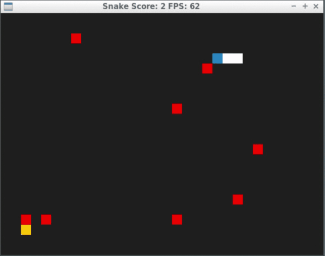

# CPPND: Capstone Snake Game Extended

This is a repo for the Capstone project in the [Udacity C++ Nanodegree Program](https://www.udacity.com/course/c-plus-plus-nanodegree--nd213). The code for this repo was inspired by [this](https://codereview.stackexchange.com/questions/212296/snake-game-in-c-with-sdl) excellent StackOverflow post and set of responses.

## Dependencies for Running Locally
* cmake >= 3.7
  * All OSes: [click here for installation instructions](https://cmake.org/install/)
* make >= 4.1 (Linux, Mac), 3.81 (Windows)
  * Linux: make is installed by default on most Linux distros
  * Mac: [install Xcode command line tools to get make](https://developer.apple.com/xcode/features/)
  * Windows: [Click here for installation instructions](http://gnuwin32.sourceforge.net/packages/make.htm)
* SDL2 >= 2.0
  * All installation instructions can be found [here](https://wiki.libsdl.org/Installation)
  * Note that for Linux, an `apt` or `apt-get` installation is preferred to building from source.
* gcc/g++ >= 5.4
  * Linux: gcc / g++ is installed by default on most Linux distros
  * Mac: same deal as make - [install Xcode command line tools](https://developer.apple.com/xcode/features/)
  * Windows: recommend using [MinGW](http://www.mingw.org/)

## Basic Build Instructions

1. Clone this repo.
2. Make a build directory in the top level directory: `mkdir build && cd build`
3. Compile: `cmake .. && make`
4. Run it: `./SnakeGame`.

## Overview of Code Structure
This project extends the basic snake game by placing good food (yellow food) and bad foods (red foods) on the screen. If the snake eats good food, its size increases and score increases. Otherwise, the size shrinks and score decreases. The bad foods are set to initial size of 2. Every time the snake eats a good food, the bad foods doubles in size. Maximum bad foods for this game is set to 32. If the snake collides with itself or its size shrink to 0, the snake is dead.
Besides the original snake game files, this project creates a "Food" class which can set the food type to good or bad and stores the SDL point to render food. The "Snake" class is updated with bool indicator "shrinking" and method "ShrinkBody". The "Game" class creates a vector of unique pointer point to newly placed foods, including good food and bad foods. The "PlaceFood" method and "Update" method are updated to be able to place and update both good food and bad foods. An "Occupied" method is added to check if a cell is been occupied or not. The "Renderer" class is updated to render both good food and bad foods.

## Explanation of rubric satisfaction
Besides satisfaction of basic rubric points. The extra points of satisfaction are:
1. The project uses Object Oriented Programming techniques: this project creats new object "Food" to represent food object and has attributes and class methods.
2. Classes use appropriate access specifiers for class members: All class data members in "Food" and other classes are explicitly specified as public, protected, or private.
3. Class constructors utilize member initialization lists: "Food" class utilize member initialization lists for initialization.
4. The project follows the Rule of 5: "Food" class defined all of copy constructor, copy assignment operator, move constructor, move assignment operator and destructor.
5. The project uses move semantics to move data, instead of copying it, where possible: move semantics is used in "Food" class and "Game" class.
6. The project uses smart pointers instead of raw pointers: unique pointer is used in "Game" class to manage foods.
# CppND-Capstone-Snake-Game
# CppND-Capstone-Snake-Game
